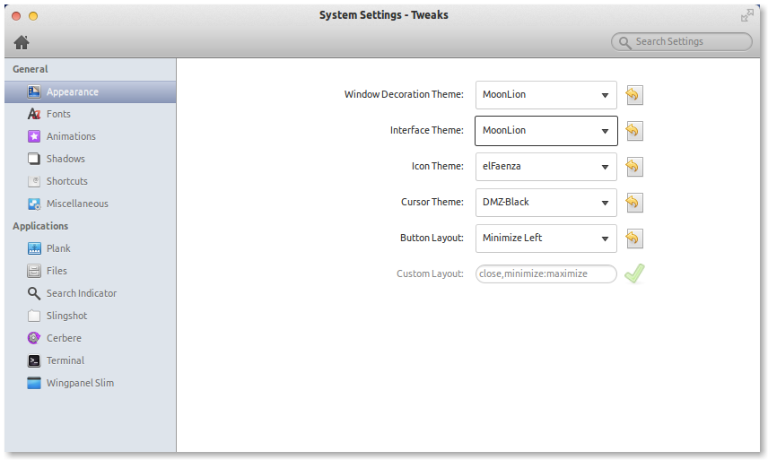

# MoonLion theme for elementaryOS

This theme just mixes and packs two great GNOME themes from [kxmylo][kxmy] for [elementaryOS][luna] 0.2 "Luna":

- [Lion][lion]
- [Lion GTK 3.8][lgtk]

Additionally, annoying error messages and syntax warnings were fixed from some CSS files (GTK-3.0).

## Installation

Just clone this repository into your `~/.themes/` directory (create it if it doesn't exist):

    $ cd
    $ mkdir .themes
    $ cd .themes
    $ git clone https://github.com/vivaserver/MoonLion.git

Select "MoonLion" for the **Window Decoration Theme** and **Interface Theme** options of the "Appearance" settings.

You will need to install the `elementary-tweaks` package from the [elementary-update PPA][eppa] to enable the "Tweaks" option in your System Settings application (see next section)

### elementary-tweaks installation

First add the PPA repository and then install the proper package:

    $ sudo apt-add-repository ppa:versable/elementary-update
    $ sudo apt-get update 
    $ sudo apt-get install elementary-tweaks

## More Credits

* Faenza Icon Theme  
  `elementary-elfaenza-icons` package, install like elementary-tweaks
* [OS X Mountain Lion Wallpaper][wall] mod by Dee-A

## Contributing

- This is my first theme at all, so please feel free to fork and contribute fixes and improvements.
- You can also help me keep this repository up-to-date with the kxmylo theme packages as they are released on deviantart.
- Or may be help me pack this theme into a `.deb` file for an easier installation?

## Copyleft

(c)2014 Cristian R. Arroyo <cristian.arroyo@vivaserver.com>

## License

See LICENCE.txt

[luna]: http://elementaryos.org/
[kxmy]: http://kxmylo.deviantart.com
[lion]: http://kxmylo.deviantart.com/art/Lion-an-elementary-OS-theme-384663827
[lgtk]: http://kxmylo.deviantart.com/art/Lion-GTK-3-8-386686956
[eppa]: https://launchpad.net/~versable/+archive/elementary-update
[wall]: http://dee-a.deviantart.com/art/OS-X-Mountain-Lion-Wallpaper-361526011
